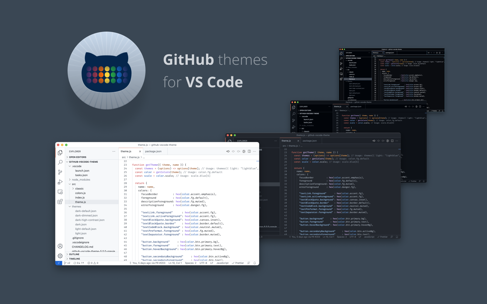
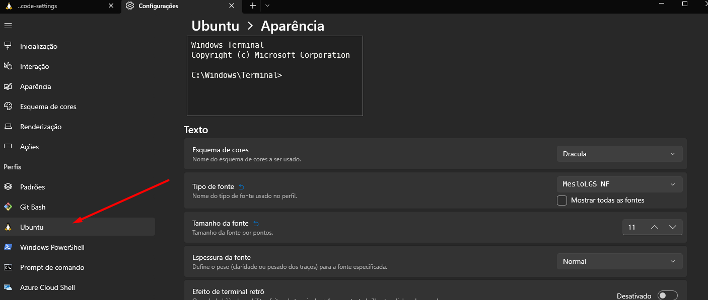

# Minhas configurações do VSCode


Aqui você encontrará minhas principais configurações do VSCode que uso em minha máquina.
Minhas configurações estão sendo sempre atualizadas conforme meu gosto e necessidades, mas o que está aqui é todo conhecimento meu de configuração do VSCode acumulado de mais de 2 anos.

Usar estas configurações te trará a vantagem de já ter um ambiente de desenvolvimento no VSCode muito produtivo.

As configurações estão separadas nos seguintes tópicos:

* [Backup e sincronização das configurações do VSCode](#backup-e-sincronização-das-configurações-do-vscode)
* [Tema](#tema)
* [Font-family](#font-family)
* [Shell default](#shell-default)
* [Extensões](#extensões)
* [Alguns settings relevantes](#alguns-settings-relevantes)


## Backup e sincronização das configurações do VSCode

No 1º semestre de 2022, o VSCode permite backup das suas configurações e sincronização com o servidor do GitHub. Siga as instruções do link [https://code.visualstudio.com/docs/editor/settings-sync](https://code.visualstudio.com/docs/editor/settings-sync) e ative isto, agora você nunca mais perderá suas configurações e ainda poderá sincroniza-las com outros computadores.

## Tema

[Github Theme](https://marketplace.visualstudio.com/items?itemName=GitHub.github-vscode-theme) - Estilo `Github Dark`.





## Font-family

Usar uma fonte adequada para desenvolvimento melhorará seu conforto ao programar e ler código, escolha uma fonte adequada.

Eu uso a [JetBrains Mono](https://www.jetbrains.com/lp/mono/) como fonte padrão.

Instale-a no seu computador e ativa-a no VSCode alterando a opção `editor.fontFamily`, exemplo:
```json
"editor.fontFamily": "\"JetBrains Mono\", 'Courier New', monospace",
```
Esta propriedade permite outras fontes como fallback se as primeiras não existirem.

## Shell default

Ter um shell que facilite a digitação de comandos é essencial para o desenvolvimento de software, eu uso o [oh my zsh](https://ohmyz.sh/).

Ele guardará histórico dos comandos, facilitará auto-complete entre outras coisas.

Neste [link](https://github.com/argentinaluiz/ambiente-dev-produtivo) eu mostro dicas de como instala-lo, além de configurações e ferramentas utilizado para Mac, Linux e Windows.

O oh my zsh permite configurar um tema de cores, eu uso o [powerlevel10k](https://github.com/romkatv/powerlevel10k). No link há instruções de como instala-lo e habilita-lo no oh my zsh. Instale também a fonte `Meslo Nerd` através do link: [https://github.com/romkatv/powerlevel10k#meslo-nerd-font-patched-for-powerlevel10k](https://github.com/romkatv/powerlevel10k#meslo-nerd-font-patched-for-powerlevel10k).

> Para Windows:

> No Windows Terminal para a font Meslo Nerd funcionar no WSL, é necessário acessar Configurações -> Selecionar o Linux do lado esquerdo, clicar em Aparências em Configurações Adicionais e selecionar a fonte Meslo Nerd, como está na imagem:

> 


## Extensões

Minhas extensões podem ser facilmente instaladas no seu VSCode executando os seguintes comandos:
```bash
wget https://raw.githubusercontent.com/argentinaluiz/my-vscode-settings/main/vscode-settings/extensions.txt
wget -O - https://raw.githubusercontent.com/argentinaluiz/my-vscode-settings/main/install-extensions.sh | bash
```

## Alguns settings relevantes

### Modo de salvamento de arquivos

Ative-a clicando em `File` e depois em `Auto Save` no menu.

### Extensões padrões no Remote Container

Se você usar o Remote Container para melhorar seu ambiente com o Docker, defina algumas extensões padrões que sempre estarão nos container.

Vá em Files -> Settings, pesquise por `remote.containers.defaultExtensions` e acrescente suas extensões padrões para containers.

As minhas são:
```
    "bungcip.better-toml",
    "christian-kohler.path-intellisense",
    "dbaeumer.vscode-eslint",
    "donjayamanne.githistory",
    "esbenp.prettier-vscode",
    "hazer.reactcodesnippets",
    "humao.rest-client",
    "johnpapa.vscode-peacock",
    "mikestead.dotenv",
    "ms-azuretools.vscode-docker",
    "naumovs.color-highlight",
    "oderwat.indent-rainbow",
    "shan.code-settings-sync",
    "sonarsource.sonarlint-vscode",
    "steoates.autoimport",
    "streetsidesoftware.code-spell-checker",
    "streetsidesoftware.code-spell-checker-portuguese-brazilian",
    "wix.vscode-import-cost",
    "xyz.local-history",
    "zignd.html-css-class-completion",
    "eamodio.gitlens",
    "vivaxy.vscode-conventional-commits",
    "github.copilot",
    "alefragnani.bookmarks"
```

### Extensão Peacock

Esta extensão permite colorir as bordas do VSCode, ajudando a identificar melhor vários VSCodes abertos. Você pode criar um esquema de cores por tecnologia e selecionar a cor para diferenciar os VSCodes abertos.

Abra o `File -> Settings -> Peacock`, e selecione o esquema de cores que desejar. Você pode editar o `settings.json` para adicionar mais cores facilmente, aqui estão as minhas:
```json
"peacock.favoriteColors": [
    {
      "name": "Angular",
      "value": "#a6120d"
    },
    {
      "name": "Angular Red",
      "value": "#dd0531"
    },
    {
      "name": "Apache Kafka",
      "value": "#000000"
    },
    {
      "name": "Azure Blue",
      "value": "#007fff"
    },
    {
      "name": "Django",
      "value": "#0C4B33"
    },
    {
      "name": "Golang",
      "value": "#007d9c"
    },
    {
      "name": "JavaScript Yellow",
      "value": "#f9e64f"
    },
    {
      "name": "Keycloak",
      "value": "#39a5dc"
    },
    {
      "name": "Kubernetes",
      "value": "#436ee3"
    },
    {
      "name": "Laravel",
      "value": "#fb503b"
    },
    {
      "name": "Loopback",
      "value": "#3f5dff"
    },
    {
      "name": "Mandalorian Blue",
      "value": "#1857a4"
    },
    {
      "name": "Nest.js",
      "value": "#e0234e"
    },
    {
      "name": "Node Green",
      "value": "#215732"
    },
    {
      "name": "Python",
      "value": "#25415d"
    },
    {
      "name": "React Blue",
      "value": "#61dafb"
    },
    {
      "name": "Something Different",
      "value": "#832561"
    },
    {
      "name": "Svelte Orange",
      "value": "#ff3d00"
    },
    {
      "name": "Vue Green",
      "value": "#42b883"
    },
    {
      "name": "RabbitMQ",
      "value": "#f60"
    },
    {
      "name": "TypeScript",
      "value": "#007acc"
    }
  ],
```

### Selecionar qualquer texto no terminal ao selecionar com mouse


Ative a opção: `"terminal.integrated.copyOnSelection": true`