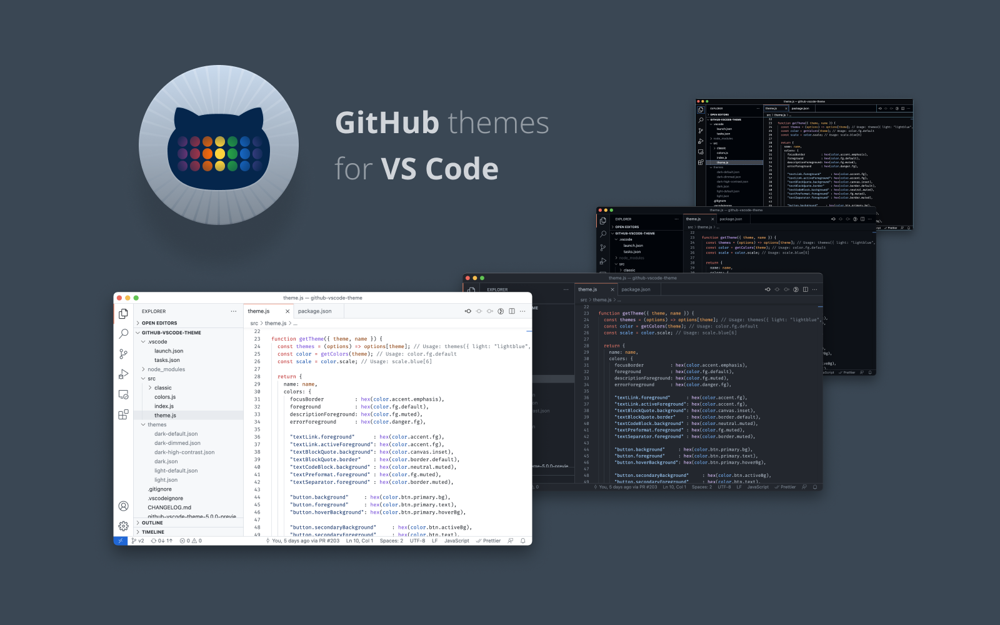

# ⚙️ Minhas configurações do VSCode

> 💡 **5+ anos de experiência** condensados em um ambiente de desenvolvimento altamente produtivo para VSCode

Aqui você encontrará minhas principais configurações do VSCode que uso profissionalmente. Estas configurações foram refinadas ao longo de mais de 5 anos de desenvolvimento, focando em **produtividade**, **legibilidade** e **eficiência**.

## � VSCode Insiders - Recomendação

**Recomendo fortemente usar o [VSCode Insiders](https://code.visualstudio.com/insiders/)** ao invés da versão estável.

**Por que usar o Insiders?**
- ✅ Atualizações diárias com as últimas funcionalidades
- ✅ Acesso antecipado a novos recursos e melhorias
- ✅ Surpreendentemente estável apesar das atualizações frequentes
- ✅ Mesma experiência profissional da versão estável
- ✅ Não interfere com a instalação da versão estável (pode ter ambas)

**⚠️ IMPORTANTE sobre settings.json:**

Algumas configurações neste repositório podem funcionar **apenas no VSCode Insiders**. Quando você adicionar uma configuração no `settings.json` e ela aparecer com **cor mais escura/esmaecida** (como se estivesse desabilitada), isso significa que:
- A configuração não é suportada na versão atual do seu VSCode
- Pode ser uma funcionalidade experimental disponível apenas no Insiders
- Será suportada em versões futuras do VSCode estável

Não se preocupe: configurações não suportadas são simplesmente ignoradas e não causam problemas.

**⚠️ Sobre extensões no Insiders:**

Ao usar o VSCode Insiders, algumas extensões (especialmente as da Microsoft) podem solicitar que você mude para a **Pre-Release Version** ao invés da versão estável. Aceite essas sugestões para garantir compatibilidade total com o Insiders e aproveitar funcionalidades avançadas que só estão disponíveis nas versões de pré-lançamento.

---

## 📑 Índice

### 🚀 Recomendações Iniciais
- [VSCode Insiders](#-vscode-insiders---recomendação)

### 🎨 Aparência e Interface
- [Tema](#-tema)
- [Tipografia (Font-family)](#-tipografia-font-family)

### 🔧 Ambiente de Desenvolvimento
- [Shell Padrão](#-shell-padrão)
- [Extensões Recomendadas](#-extensões-recomendadas)

### ✏️ Editor e Produtividade
- [Configurações do Editor](#%EF%B8%8F-configurações-do-editor)
- [Inlay Hints - Dicas de Tipo](#-inlay-hints---dicas-de-tipo-inline)
- [Configurações de Produtividade](#-configurações-de-produtividade)
- [Configurações do Terminal](#-configurações-do-terminal)

### 🤖 IA e Recursos Avançados
- [GitHub Copilot Chat](#-github-copilot-chat)
- [Code Spell Checker](#-code-spell-checker)

### 💾 Backup e Sincronização
- [Settings Sync](#-backup-e-sincronização)

---

## 🎨 Aparência e Interface

### 🌙 Tema

Eu uso o [Github Theme](https://marketplace.visualstudio.com/items?itemName=GitHub.github-vscode-theme) no estilo `Github Dark`.



### 🔤 Tipografia (Font-family)

Usar uma fonte adequada para desenvolvimento melhora significativamente o conforto ao programar e ler código.

Eu uso a [JetBrains Mono](https://www.jetbrains.com/lp/mono/) como fonte padrão.

Instale-a no seu computador e ative-a no VSCode alterando a opção `editor.fontFamily`, exemplo:

```json
"editor.fontFamily": "\"JetBrains Mono\", 'Courier New', monospace",
```

Esta propriedade permite outras fontes como fallback se as primeiras não existirem.

---

## 🔧 Ambiente de Desenvolvimento

### 🐚 Shell Padrão

Ter um shell que facilite a digitação de comandos é essencial para o desenvolvimento de software. Eu uso o [fish](https://fishshell.com/).

Ele guardará histórico dos comandos, facilitará autocompletar entre outras coisas.

Neste [link](https://github.com/argentinaluiz/ambiente-dev-produtivo) eu mostro dicas de como instalá-lo, além de configurações e ferramentas utilizadas para Mac, Linux e Windows.

O fish permite configurar temas. Eu uso o [starship](https://starship.rs/) e no link há instruções de como instalá-lo e habilitá-lo no fish.

### 📦 Extensões Recomendadas

Minhas extensões podem ser facilmente instaladas no seu VSCode executando os seguintes comandos:

**Para VSCode Insiders (Recomendado):**
```bash
wget https://raw.githubusercontent.com/argentinaluiz/my-vscode-settings/main/vscode-settings/extensions.txt
wget -O - https://raw.githubusercontent.com/argentinaluiz/my-vscode-settings/main/install-extensions-insiders.sh | bash
```

**Para VSCode Estável:**
```bash
wget https://raw.githubusercontent.com/argentinaluiz/my-vscode-settings/main/vscode-settings/extensions.txt
wget -O - https://raw.githubusercontent.com/argentinaluiz/my-vscode-settings/main/install-extensions.sh | bash
```

**💡 Dica:** Você pode clonar o arquivo `extensions.txt` e editar para remover extensões que não deseja instalar antes de executar o script. Isso permite personalizar a instalação de acordo com suas necessidades específicas.

**ℹ️ Nota:** Algumas extensões ficarão desabilitadas após a instalação, pois são usadas apenas eventualmente em contextos específicos. Você pode habilitá-las quando necessário através da aba de extensões.

---

**📌 Destaques:** A lista completa no arquivo `extensions.txt` contém dezenas de extensões. Abaixo estão destacadas as **mais recomendadas e essenciais** para aumentar sua produtividade:

#### 🤖 GitHub Copilot - IA Gratuita

O [GitHub Copilot Chat](https://marketplace.visualstudio.com/items?itemName=GitHub.copilot-chat) é a principal ferramenta de IA da GitHub e pode ser usado **gratuitamente** no VSCode!

**⚠️ Nota:** A extensão GitHub Copilot (sem Chat) está sendo depreciada. Todas as funcionalidades (autocompletar código, chat, geração de código) agora estão integradas na extensão **GitHub Copilot Chat**.

Esta extensão transforma seu VSCode em um ambiente de desenvolvimento assistido por IA, oferecendo:
- ✅ Autocompletar código com IA
- ✅ Chat integrado para tirar dúvidas e gerar código
- ✅ Sugestões contextuais em tempo real
- ✅ Geração automática de testes

Tudo isso acelerando drasticamente sua produtividade.

#### � Code Spell Checker - Correção Ortográfica

O [Code Spell Checker](https://marketplace.visualstudio.com/items?itemName=streetsidesoftware.code-spell-checker) é essencial para evitar erros de digitação em código, comentários e documentação. 

Recomendo também instalar a extensão de idioma para português: [Code Spell Checker Portuguese - Brazilian](https://marketplace.visualstudio.com/items?itemName=streetsidesoftware.code-spell-checker-portuguese-brazilian)

Com essas extensões, você terá verificação ortográfica em inglês e português, reduzindo significativamente erros de digitação em seu código e documentação.

#### 🔧 GitHub Actions e Pull Requests

Para quem trabalha com GitHub, estas extensões são indispensáveis:

- **[GitHub Actions](https://marketplace.visualstudio.com/items?itemName=github.vscode-github-actions)** - Gerencie e monitore GitHub Actions diretamente no VSCode
- **[GitHub Pull Requests](https://marketplace.visualstudio.com/items?itemName=GitHub.vscode-pull-request-github)** - Crie, revise e gerencie Pull Requests sem sair do editor

Essas extensões permitem gerenciar todo o fluxo de trabalho do GitHub (PRs, reviews, actions) de dentro do próprio VSCode, aumentando sua produtividade.

#### 🌐 REST Client - Teste APIs sem sair do VSCode

O [REST Client](https://marketplace.visualstudio.com/items?itemName=humao.rest-client) permite testar APIs HTTP/REST diretamente no VSCode, sem precisar de ferramentas externas como Postman ou Insomnia.

**Por que é importante:**
- ✅ Crie arquivos `.http` ou `.rest` versionados junto com seu código
- ✅ Teste endpoints rapidamente com sintaxe simples
- ✅ Suporte a variáveis de ambiente e requisições encadeadas
- ✅ Histórico de requisições e resposta formatada (JSON, XML, HTML)
- ✅ Perfeito para documentar APIs do projeto

**Exemplo de uso:**
```http
### Get all users
GET https://api.example.com/users HTTP/1.1
Authorization: Bearer {{token}}

### Create new user
POST https://api.example.com/users HTTP/1.1
Content-Type: application/json

{
  "name": "John Doe",
  "email": "john@example.com"
}
```

Basta clicar em "Send Request" acima de cada requisição para executá-la e ver a resposta inline.

#### 🐧 WSL - Windows Subsystem for Linux

A extensão [WSL](https://marketplace.visualstudio.com/items?itemName=ms-vscode-remote.remote-wsl) é **essencial** para desenvolvedores Windows que usam Linux via WSL. Ela permite conectar o VSCode diretamente ao ambiente Linux.

**Por que é importante:**
- ✅ Performance de I/O drasticamente superior (arquivos acessados diretamente no filesystem Linux)
- ✅ Todas as extensões funcionam no contexto Linux
- ✅ Ferramentas e dependências instaladas no WSL ficam disponíveis
- ✅ Terminal integrado executa comandos diretamente no Linux

**⚠️ IMPORTANTE:** Para aproveitar todos os benefícios, o VSCode precisa estar no modo **"WSL: Ubuntu"** (ou sua distro). Você verá isso no canto inferior esquerdo da janela.

**Como abrir projetos no WSL:**
1. **Via terminal WSL:** `code /caminho/do/projeto`
2. **Via Command Palette (Ctrl+Shift+P):**
   - `WSL: Connect to WSL` - Conecta a uma nova janela no WSL
   - `WSL: Open Folder in WSL` - Abre pasta específica no WSL

Sem esta extensão e sem estar no modo WSL, você terá performance reduzida e incompatibilidades com extensões.


#### �🐳 Extensão Docker Recomendada

Recomendo fortemente instalar a [Docker DX](https://marketplace.visualstudio.com/items?itemName=docker.docker) (mantida oficialmente pela Docker) em vez da extensão Docker da Microsoft. Ela oferece:

- ✅ Autocomplete mais robusto para Dockerfile e Docker Compose
- ✅ Suporte a Dockerfile Debug (depuração de builds)
- ✅ Atualizações mais frequentes e recursos mais recentes
- ✅ Melhor integração com o ecossistema Docker

**📺 Tutorial:** Veja como usar o Dockerfile Debug neste [vídeo](https://youtu.be/7tGdy89_Mqo?si=SPjtT5W60pZVlMgd)

#### 🐳 Dev Containers

A extensão Dev Containers permite desenvolver dentro de containers Docker, isolando completamente o ambiente de desenvolvimento da sua máquina local.

**Benefícios:**
- ✅ Ambiente de desenvolvimento consistente entre toda a equipe
- ✅ Não precisa instalar dependências (Node, Python, Go, etc.) na sua máquina
- ✅ Projetos com versões diferentes de linguagens sem conflitos
- ✅ Onboarding de novos desenvolvedores em minutos
- ✅ "Funciona na minha máquina" deixa de ser problema

**📺 Tutorial completo:** [Dev Container: Desenvolva aplicações sem ter nada na sua máquina](https://youtu.be/kPA9PR7GCrY?si=WF4I85biXFlPTNtW)

Se você usar a extensão Dev Containers para melhorar seu ambiente com o Docker, defina algumas extensões padrão que sempre estarão nos containers.

Vá em File -> Settings, pesquise por `dev.containers.defaultExtensions` ou adicione diretamente no `settings.json`:

```json
"dev.containers.defaultExtensions": [
  "dbaeumer.vscode-eslint",
  "donjayamanne.githistory",
  "esbenp.prettier-vscode",
  "humao.rest-client",
  "johnpapa.vscode-peacock",
  "mikestead.dotenv",
  "ms-azuretools.vscode-docker",
  "naumovs.color-highlight",
  "oderwat.indent-rainbow",
  "streetsidesoftware.code-spell-checker",
  "streetsidesoftware.code-spell-checker-portuguese-brazilian",
  "xyz.local-history",
  "eamodio.gitlens",
  "github.copilot",
  "alefragnani.bookmarks",
  "GitHub.copilot-chat",
  "redhat.vscode-yaml"
]
```

Esta configuração garante que todas essas extensões essenciais estarão disponíveis automaticamente em qualquer container que você abrir, sem precisar reinstalá-las manualmente. Isso inclui ferramentas de linting (ESLint), formatação (Prettier), controle de versão (GitLens, Git History), produtividade (Copilot, Bookmarks) e outras utilidades importantes.

#### 🎨 Extensão Peacock - Cores por Projeto

Esta extensão permite colorir as bordas do VSCode, ajudando a identificar melhor várias janelas do VSCode abertas. Você pode criar um esquema de cores por tecnologia e selecionar a cor para diferenciar as janelas abertas.

Abra o `File -> Settings -> Peacock`, e selecione o esquema de cores que desejar. Você pode editar o `settings.json` para adicionar mais cores facilmente. Aqui estão as minhas:

```json
"peacock.favoriteColors": [
    {
      "name": "Angular",
      "value": "#a6120d"
    },
    {
      "name": "Angular Red",
      "value": "#dd0531"
    },
    {
      "name": "Apache Kafka",
      "value": "#000000"
    },
    {
      "name": "Azure Blue",
      "value": "#007fff"
    },
    {
      "name": "Docker",
      "value": "#1d63ed"
    },
    {
      "name": "Django",
      "value": "#0C4B33"
    },
    {
      "name": "Golang",
      "value": "#007d9c"
    },
    {
      "name": "JavaScript Yellow",
      "value": "#f9e64f"
    },
    {
      "name": "Java",
      "value": "#f7901e"
    },
    {
      "name": "Keycloak",
      "value": "#4d4d4d"
    },
    {
      "name": "Kubernetes",
      "value": "#436ee3"
    },
    {
      "name": "Laravel",
      "value": "#fb503b"
    },
    {
      "name": "Loopback",
      "value": "#3f5dff"
    },
    {
      "name": "Mandalorian Blue",
      "value": "#1857a4"
    },
    {
      "name": "Nest.js",
      "value": "#e0234e"
    },
    {
      "name": "Node Green",
      "value": "#215732"
    },
    {
      "name": "Python",
      "value": "#25415d"
    },
    {
      "name": "React Blue",
      "value": "#61dafb"
    },
    {
      "name": "Something Different",
      "value": "#832561"
    },
    {
      "name": "Svelte Orange",
      "value": "#ff3d00"
    },
    {
      "name": "Vue Green",
      "value": "#42b883"
    },
    {
      "name": "RabbitMQ",
      "value": "#f60"
    },
    {
      "name": "TypeScript",
      "value": "#007acc"
    }
  ],
```

##### Ajustes de elementos

```json
"peacock.elementAdjustments": {
  "statusBar": "darken",
  "titleBar": "darken",
  "activityBar": "darken"
},
"peacock.affectTabActiveBorder": true
```

Estas configurações escurecem levemente a barra de status, barra de título e barra de atividades para criar contraste com a cor escolhida. A última opção também colore a borda da aba ativa, tornando ainda mais fácil identificar o workspace ativo.

---

## ✏️ Editor e Produtividade

### ⚙️ Configurações do Editor

Configurações que melhoram a experiência visual e de navegação no editor:

#### Tamanho e espaçamento da fonte

```json
"editor.fontSize": 13.2,
"editor.lineHeight": 1.7
```

Define o tamanho da fonte em 13.2 pixels e o espaçamento entre linhas em 1.7, proporcionando melhor legibilidade do código.

#### Zoom com roda do mouse

```json
"editor.mouseWheelZoom": true
```

Permite dar zoom no editor segurando `Ctrl` (ou `Cmd` no Mac) e usando a roda do mouse, facilitando ajustes rápidos de visualização.

#### Edição vinculada (Linked Editing)

```json
"editor.linkedEditing": true
```

Quando habilitado, ao editar uma tag HTML/JSX, a tag de fechamento correspondente é automaticamente atualizada. Muito útil para evitar erros de sintaxe.

#### Colorização de pares de colchetes

```json
"editor.bracketPairColorization.enabled": true,
"editor.bracketPairColorization.independentColorPoolPerBracketType": true
```

Colore automaticamente pares de `{}`, `[]` e `()` com cores diferentes, facilitando a identificação de blocos de código aninhados. A segunda opção usa cores independentes para cada tipo de colchete.

#### Ligaduras de fonte

```json
"editor.fontLigatures": false
```

Desativa ligaduras tipográficas. Se você usa fontes como Fira Code ou JetBrains Mono e prefere ver os caracteres individuais (como `!=`, `=>`, `>=`) ao invés de símbolos unidos, mantenha como `false`.

### 🔍 Inlay Hints - Dicas de Tipo Inline

Inlay Hints são dicas visuais que aparecem inline no código mostrando tipos de variáveis, parâmetros de funções, valores de retorno e mais. Elas melhoram significativamente a legibilidade do código sem precisar passar o mouse sobre elementos.

#### Configuração global

```json
"editor.inlayHints.enabled": "offUnlessPressed",
"editor.inlayHints.padding": true
```

- `"offUnlessPressed"`: Os hints ficam ocultos por padrão e aparecem apenas quando você pressiona `Ctrl+Alt` (ou `Ctrl+Option` no Mac)
- `padding`: Adiciona espaçamento ao redor dos hints para melhor legibilidade

#### TypeScript e JavaScript

```json
"js/ts.inlayHints.parameterNames.enabled": "all",
"js/ts.inlayHints.variableTypes.enabled": true,
"js/ts.inlayHints.propertyDeclarationTypes.enabled": true,
"js/ts.inlayHints.parameterTypes.enabled": true,
"js/ts.inlayHints.functionLikeReturnTypes.enabled": true,
"js/ts.inlayHints.enumMemberValues.enabled": true
```

Exibe inline:
- **Nomes de parâmetros**: Mostra o nome do parâmetro ao lado do valor passado em chamadas de função
- **Tipos de variáveis**: Exibe o tipo inferido de variáveis
- **Tipos de propriedades**: Mostra tipos em declarações de propriedades de classes e interfaces
- **Tipos de parâmetros**: Exibe tipos de parâmetros de função
- **Tipos de retorno**: Mostra o tipo de retorno de funções
- **Valores de enum**: Exibe os valores numéricos de membros de enum

#### Python (Pylance)

```json
"python.analysis.inlayHints.functionReturnTypes": true,
"python.analysis.inlayHints.variableTypes": true,
"python.analysis.inlayHints.callArgumentNames": true,
"python.analysis.inlayHints.pytestParameters": true
```

Mostra tipos de retorno de funções, tipos de variáveis, nomes de argumentos em chamadas de função e parâmetros de fixtures do pytest. Requer a extensão **Pylance**.

#### Go

```json
"go.inlayHints.assignVariableTypes": true,
"go.inlayHints.compositeLiteralFields": true,
"go.inlayHints.compositeLiteralTypes": true,
"go.inlayHints.constantValues": true,
"go.inlayHints.parameterNames": true,
"go.inlayHints.rangeVariableTypes": true,
"go.inlayHints.functionTypeParameters": true
```

Exibe tipos de variáveis atribuídas, campos de structs, tipos de literais compostos, valores de constantes, nomes de parâmetros, tipos em range loops e parâmetros de tipo em funções. Requer a extensão **Go**.

### ⚡ Configurações de Produtividade

Configurações que aumentam a eficiência no desenvolvimento:

#### Auto Save (Salvamento Automático)

```json
"files.autoSave": "onFocusChange"
```

Salva automaticamente os arquivos quando você muda o foco para outra janela ou arquivo. Evita perda de trabalho e mantém tudo sincronizado. Outras opções: `"off"`, `"afterDelay"`, `"onWindowChange"`.

#### Sugestões Inline

```json
"editor.inlineSuggest.enabled": true
```

Habilita sugestões inline do GitHub Copilot e outras extensões de AI diretamente no editor enquanto você digita.

#### File Nesting (Agrupamento de Arquivos)

```json
"explorer.fileNesting.enabled": true
```

Agrupa arquivos relacionados no explorador. Por padrão, o VSCode já agrupa arquivos como `.ts` e seu `.js`, `package.json` e `package-lock.json`, etc. Você pode customizar regras adicionais em `explorer.fileNesting.patterns`.

#### Quick Suggestions (Sugestões Rápidas)

```json
"editor.quickSuggestions": {
  "other": "on",
  "comments": "on",
  "strings": "on"
}
```

Ativa sugestões automáticas de código em todos os contextos: código normal, comentários e dentro de strings. Melhora significativamente a produtividade com autocomplete.

#### Import Module Specifier (TypeScript)

```json
"typescript.preferences.importModuleSpecifier": "project-relative"
```

Ao adicionar imports automaticamente, usa caminhos relativos ao projeto ao invés de caminhos relativos ao arquivo atual. Facilita refatorações e mantém imports consistentes.

#### Atualização automática de imports

```json
"javascript.updateImportsOnFileMove.enabled": "never"
```

Desabilita a atualização automática de imports ao mover arquivos. Definido como `"never"` para ter controle manual, mas você pode usar `"always"` para atualização automática.

### 💻 Configurações do Terminal

#### Copiar texto ao selecionar

```json
"terminal.integrated.copyOnSelection": true
```

Copia automaticamente para a área de transferência qualquer texto selecionado no terminal integrado. Elimina a necessidade de usar `Ctrl+C` ou `Cmd+C` após selecionar, agilizando o workflow no terminal.

---

## 🤖 IA e Recursos Avançados

### 🚀 GitHub Copilot Chat

Estas configurações otimizam sua experiência com o GitHub Copilot Chat:

#### Autocompletions

```json
"github.copilot.editor.enableAutoCompletions": true
```

Habilita sugestões automáticas de código do Copilot enquanto você digita. Essencial para aproveitar ao máximo a extensão **GitHub Copilot**.

#### Controle de ativação por tipo de arquivo

```json
"github.copilot.enable": {
  "*": true,
  "plaintext": false,
  "markdown": true,
  "scminput": false
}
```

Define em quais tipos de arquivo o Copilot está ativo. Aqui está ativado para todos (`*`), desativado para texto plano e inputs do controle de versão, mas mantido para Markdown.

#### Next Edit Suggestions

```json
"github.copilot.nextEditSuggestions.enabled": true
```

Habilita sugestões do Copilot para a próxima edição que você provavelmente fará, antecipando suas necessidades.

#### Code Lens para geração de testes

```json
"github.copilot.chat.generateTests.codeLens": true
```

Adiciona um botão "Generate Tests" acima de funções e classes, permitindo gerar testes automaticamente com o Copilot Chat.

#### Inline Chat

```json
"github.copilot.chat.inlineChatCompletionTrigger.enabled": true,
"inlineChat.enableV2": true,
"terminal.integrated.experimentalInlineChat": true
```

Habilita o chat inline do Copilot diretamente no editor, permitindo fazer perguntas e editar código sem abrir o painel lateral. A última opção ativa o chat inline no terminal integrado.

#### Temporal Context (Contexto Temporal)

```json
"github.copilot.chat.editor.temporalContext.enabled": true,
"github.copilot.chat.edits.temporalContext.enabled": true
```

Permite que o Copilot use o histórico de edições recentes como contexto para fornecer sugestões mais relevantes ao seu fluxo de trabalho atual.

#### Code Search

```json
"github.copilot.chat.codesearch.enabled": true,
"github.copilot.chat.newWorkspace.useContext7": true
```

Habilita busca de código no Copilot Chat e usa o sistema Context7 para melhor compreensão do contexto do workspace.

#### Language Context (Contexto de Linguagem)

```json
"github.copilot.chat.languageContext.inline.typescript.enabled": true,
"github.copilot.chat.languageContext.fix.typescript.enabled": true,
"github.copilot.chat.languageContext.typescript.enabled": true
```

Fornece contexto específico de TypeScript ao Copilot Chat, melhorando sugestões para correções e edições inline.

#### Configurações de Chat

```json
"chat.editing.alwaysSaveWithGeneratedChanges": true,
"chat.detectParticipant.enabled": true,
"chat.editRequests": "hover",
"chat.edits2.enabled": true
```

- **alwaysSaveWithGeneratedChanges**: Salva automaticamente arquivos após o Copilot fazer alterações
- **detectParticipant**: Detecta automaticamente qual agente do chat usar (@workspace, @vscode, etc.)
- **editRequests**: Mostra botões de edição no hover
- **edits2**: Habilita a nova interface de edição do Copilot Chat

### 📝 Code Spell Checker

O Code Spell Checker ajuda a evitar erros de digitação em código, comentários e strings.

#### Idiomas suportados

```json
"cSpell.language": "en,pt,pt_BR"
```

Ativa verificação ortográfica em inglês, português e português brasileiro. Para usar, instale as extensões **Code Spell Checker** e **Code Spell Checker Portuguese - Brazilian**.

#### Dicionário customizado

```json
"cSpell.userWords": [
  "nestjs",
  "typeorm",
  "kubernetes",
  "postgresql",
  "rabbitmq",
  "dockerize",
  "microservices",
  ...
]
```

Adicione palavras técnicas, nomes de frameworks, bibliotecas, nomes de projetos e termos específicos do seu domínio para evitar que sejam marcados como erros. Isso é especialmente útil para:
- Nomes de tecnologias (nestjs, typeorm, kubectl)
- Jargões técnicos (microservices, devcontainer)
- Nomes de projetos e empresas
- Siglas e acrônimos comuns no seu trabalho

Você pode adicionar palavras clicando com o botão direito em uma palavra sublinhada e selecionando "Add to User Settings".

---

## 💾 Backup e Sincronização

Desde 2022, o VSCode permite backup das suas configurações e sincronização com o servidor do GitHub. 

**🔗 Como ativar:** Siga as instruções em [https://code.visualstudio.com/docs/editor/settings-sync](https://code.visualstudio.com/docs/editor/settings-sync)

**Benefícios:**
- ✅ Nunca mais perca suas configurações
- ✅ Sincronize entre múltiplos computadores automaticamente
- ✅ Mantenha extensões, keybindings e snippets sempre atualizados

---

<div align="center">

**⭐ Se este repositório foi útil, considere dar uma estrela!**

</div>
